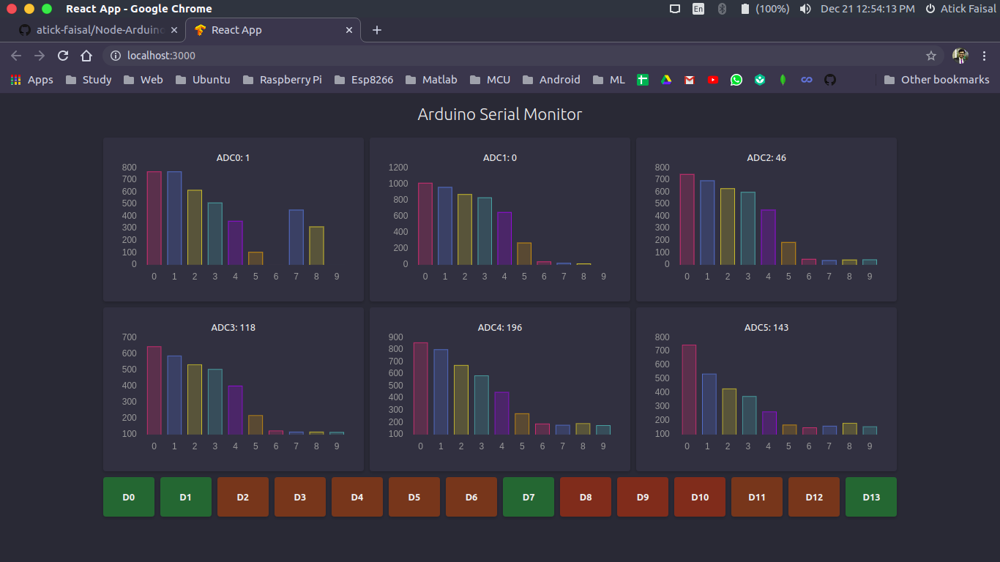
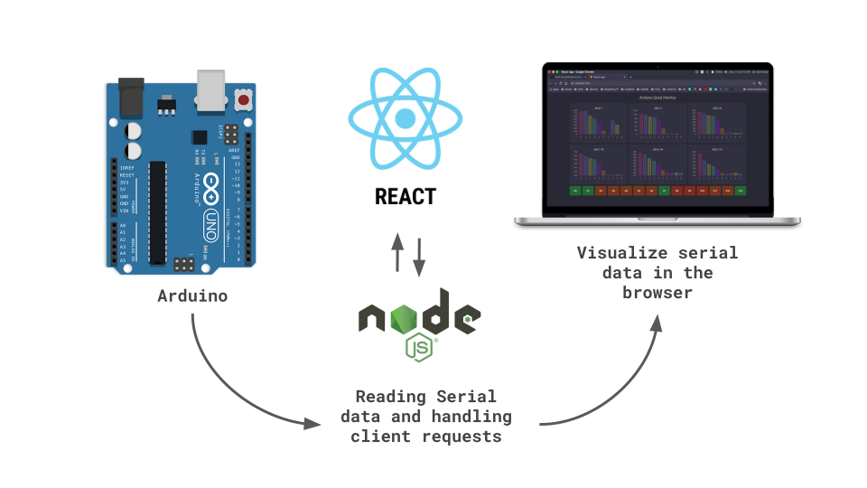

# Node-Arduino-Serial-Monitor  
[](https://github.com/ellerbrock/open-source-badges/) [](https://opensource.org/licenses/Apache-2.0) [](https://GitHub.com/Naereen/StrapDown.js/graphs/commit-activity)

<br>

<p align="center">
  
</p>

## Working Principle
<p align="center">
  
</p>

## How to use

#### 0. Upload the Arduino code
Upload the code for Arduino and check the port number. Later change the port number in server.js accordingly.

#### 1. Cone the repository
```
git clone https://github.com/atick-faisal/Node-Arduino-Serial-Monitor.git
```
#### 2. Change directory into the project
```
cd Sensor-Dashboard
```
#### 3. Install backend dependencies
```
npm install
```
#### 4. Install frontend dependencies
```
npm run client-install
```
#### 5. Run the server
```
node server.js
```
#### 6. Run the client
```
cd client/
npm start
```
  
## License
[](https://creativecommons.org/licenses/by-nc-sa/4.0)

This work is licensed under [Apache-2.0](https://www.apache.org/licenses/LICENSE-2.0).
